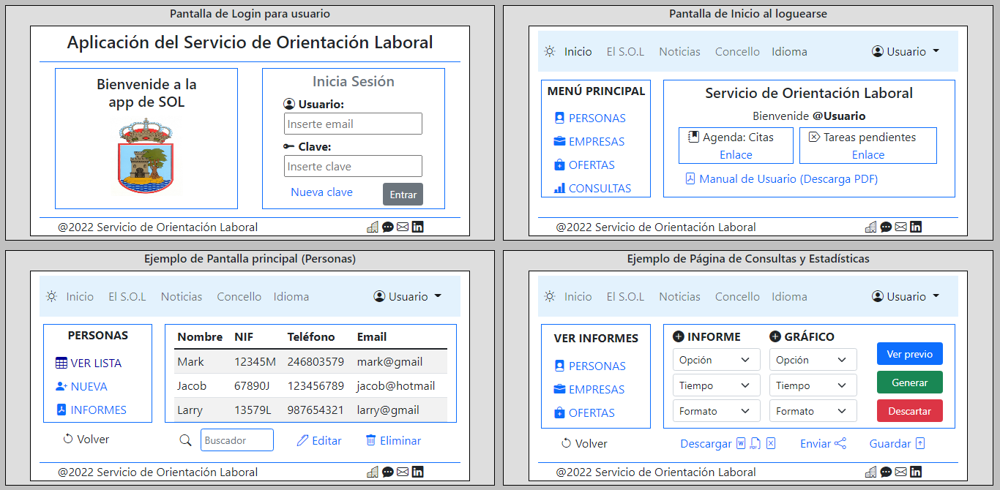
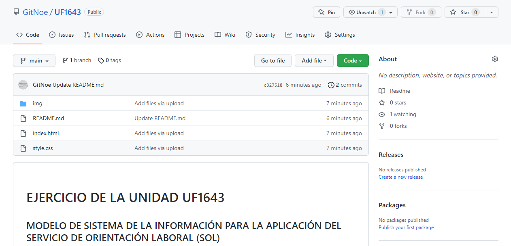

# EJERCICIO DE LA UNIDAD UF1643

## MODELO DE SISTEMA DE LA INFORMACIÓN PARA LA APLICACIÓN DEL SERVICIO DE ORIENTACIÓN LABORAL (SOL)

El objetivo de este ejercicio es elaborar un modelo de información de la aplicación que nos solicitan desde el SOL, de forma que quede documentado cómo se procedería para hacer la aplicación, qué funcionalidades incluiría y cómo sería utilizada por los usuarios a los que va dirigida; todo desde un punto de vista externo a los avances que se han hecho hasta el momento de forma grupal.

### Requerimientos funcionales

La aplicación tiene como objetivo ser un portal de registro, introducción y manipulación de información de las personas que se incluirían en una de base de datos protegida, de forma que sólo los usuarios con acceso permitido podrían manipular esos datos. Esta información se referiría a personas que harían uso del Servicio de Orientación, empresas que colaboran con el mismo, e informes estadísticos de los datos acumulados en el tiempo. En definitiva, la aplicación funcionaría como un registro multidisciplinal y relacional de todos estos distintos elementos que el Servicio de Orientación Laboral considera útiles para cumplir con su cometido.

En cuanto a los tipos de usuarios que tendrían acceso a la información, creo que lo más conveniente sería crear una aplicación de intranet, donde solo los usuarios autorizados pudieran acceder a ella y a sus contenidos. De esta forma no habría ninguna vía "pública" por la que acceder a información sensible por parte de personas ajenas al Servicio. Una puntualización, sin embargo, sería la necesidad de crear al menos dos tipos de usuario: uno raso con privilegios o permisos limitados, y uno de administrador que pudiera controlar todo tipo de elementos e incluso manipular hasta cierto punto la base de datos o sus vistas.

El usuario raso se encontraría:

- una aplicación con diversas pantallas: login, inicio, páginas principales de los distintos apartados...
- elementos interactivos: menús, botones, iconos a modo de enlaces, shorcuts a otras páginas o utilidades, etc.
  - los menús se diferenciarían en dos tipos: uno estático en el header que contendría las páginas "sociales" y más informativas de la aplicación, y otro vertical en el cuerpo de la página que cambiaría de contenido dependiendo del apartado en la actual vista.
- un perfil personal donde modificar sus propios datos (como contraseña de acceso, por ejemplo).

A mayores, un administrador podría ver un panel exclusivo donde dar de baja o alta a los usuarios, modificar ciertos elementos de la base o los propios datos, y ciertos privilegios que vendrían declarados por las especificaciones de nuestro cliente (el SOL).

### Casos de uso

Queda establecido que los usuarios de la aplicación serían los empleados del Servicio de Orientación, y que su uso sería orientado al registro y edición de datos de personas y empresas que hacen uso de los servicios que ofrecen. También se incluirían ofertas de trabajo y formación que estarían a disponiblidad de esos empleados para que ellos tomaran decisiones al respecto en cuanto a las personas adecuadas para esos puestos.

Entonces, ¿cómo se va a usar esta aplicación?

- El usuario cuenta con unas credenciales específicas que están previamente validadas por la aplicación para entrar en ella.
- Una vez en la página principal, dispondría de menús y funciones que le permitirían navegar por la aplicación, de forma que siempre sabría en qué apartado se encuentra y cómo volver a uno anterior o cambiar a otro.
  - Por un lado puede hacer uso del menú superior para trabajo relacionado con el Ayuntamiento.
  - Por otro puede visualizar y manipular datos de las personas y empresas beneficiarias del servicio.
- Tendría un panel personal (perfil) accesible individualmente. Aparte un administrador tendría una sección de manipulación de permisos de usuarios y otras funcionalidades.

### Presentación y estilo de la App

Se podrían puntualizar algunos elementos clave, de suma importancia a la hora de crear esquemas de págima (wireframes) u otros elementos gráficos previos a la creación de la propia app (como esquemas o diagramas):

- Debido a la naturaleza de la aplicación y el ambiente de los trabajadores del SOL, el diseño se centraría en una versión para PC, dejando a un lado (o para más tarde) la responsividad para móviles o tablets.
- El layout, la distribución de los elementos, sería lo más funcional posible, de forma que el usuario sepa siempre donde está y cómo desplazarse.
- También se intentaría que la mayor cantidad de elementos interactivos fuesen muy visuales (botones, iconos, enlaces, etc.), utilizando recursos gráficos que faciliten el uso de la aplicación sin cargarla de textos, y de manera que siempre estén a la vista las funciones u opciones que el usuario puede necesitar.
- El tono de la app intentaría ser una mezcla equilibrada entre seriedad y creatividad visual, de modo que sea claramente una app de trabajo pero sin pecar de utilizar solo colores apagados o demasiada simplicidad.

En cuanto al lenguaje a utilizar, se tendrían que estudiar los pros y contras de los disponibles o más viables para un proyecto de estas características; y después, decidir los frameworks y librerías más adecuados (a no ser que se opte por hacer código original).

### INDEX.HTML - WIREFRAMES

Como muestra de cómo luciría la aplicación se ha hecho una página en html y css dividida en 4 bloques que representan las que serían algunas de las pantallas a elaborar en la fase de desarrollo. Es una muestra estática, no funcional, con el objetivo de visualizar la distribución de elementos que se llevaría a cabo.

### Conclusión y final

Una aplicación de este calibre podría llevarse a cabo de muchas formas o puntos de vista, dependiendo de las necesidades que los usuarios finales tengan en cuanto a la forma en la que se va a utilizar. Si se programara libremente y sin límite podrían incluirse todo tipo de funcionalidades, apartados, elementos, etc., por lo que es importante disminuir ese trabajo mediante las decisiones pertinentes.

Se ha subido el ejercicio completo a un repositorio de github y se ha impreso la página de inicio del mismo para su entrega.

